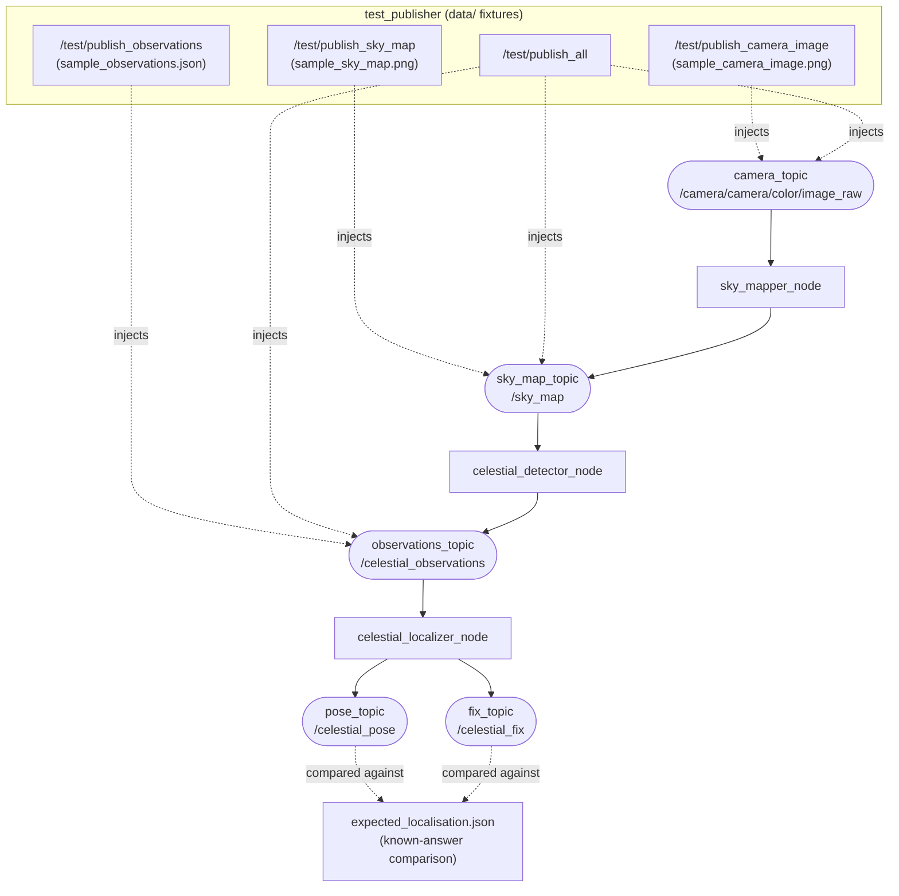

# Test Data

This directory contains deterministic input and expected-result fixtures for
pipeline injection tests. It is installed with the `celestial_bringup` package.

## Pipeline Overview

The `test_publisher` node exposes services that inject fixture data directly
onto the topics consumed by each pipeline stage, letting each stage (or the
whole chain) be exercised without a real camera or sky.



Each injection point lets you test downstream stages in isolation:

- `/test/publish_camera_image` exercises `sky_mapper_node` onward.
- `/test/publish_sky_map` skips `sky_mapper_node` and exercises `celestial_detector_node` onward.
- `/test/publish_observations` skips both `sky_mapper_node` and `celestial_detector_node`, feeding `celestial_localizer_node` directly.
- `/test/publish_all` triggers all three injections together.

## Current Test Publisher Input

### `sample_observations.json`

Used by `/test/publish_observations` and `/test/publish_all`.

It must be valid UTF-8 JSON with this structure:

```json
{
  "timestamp": "2026-08-29T12:00:00Z",
  "observations": [
    {
      "object_type": "SUN",
      "object_id": "sun",
      "azimuth": 180.0,
      "elevation": 45.0,
      "angular_uncertainty": 0.5,
      "confidence": 0.95,
      "pixel_x": 1024.0,
      "pixel_y": 384.0,
      "brightness": 255.0
    }
  ]
}
```

`timestamp` must be an ISO 8601 UTC time ending in `Z`. `object_type` must be
a valid `CelestialObservation` constant, such as `SUN`, `MOON`, or `STAR`.
The current localizer can use only `SUN` and `MOON` observations, because raw
stars do not yet have catalogue identities.

## Real Image Fixtures

`/test/publish_camera_image` requires a real image file — there is no
synthetic fallback. Set the `camera_image_file` parameter (or the
`CELESTIAL_TEST_CAMERA_IMAGE_FILE` environment variable read by the launch
file) to an absolute path readable inside the container. If the parameter
is empty or the file can't be read, the service call fails with an
explanatory message instead of publishing anything.

`/test/publish_sky_map` is a `celestial_interfaces/srv/PublishImageFile`
service (`string filename` request, `bool success` / `string message`
response) instead of a plain `Trigger`. Call it with a filename to publish
that image from the configured directory:

```bash
ros2 service call /test/publish_sky_map celestial_interfaces/srv/PublishImageFile "{filename: 'skybox_field.jpg'}"
```

The filename is resolved against `sky_map_image_dir` (env
`CELESTIAL_TEST_SKY_MAP_IMAGE_DIR`). Calling with an empty `filename` falls
back to the full path in `sky_map_image_file` (env
`CELESTIAL_TEST_SKY_MAP_IMAGE_FILE`), e.g.:

```bash
ros2 service call /test/publish_sky_map celestial_interfaces/srv/PublishImageFile "{}"
```

### `sample_camera_image.png`

Placeholder location for a recorded source camera frame. Add a valid PNG
image from the upward-facing camera; it should be a normal colour image that
can be converted to the ROS `bgr8` encoding.

### `sample_sky_map.png`

Placeholder location for a recorded or generated sky map. Add a valid PNG in
the same equirectangular projection published on `/sky_map`; use the
configured sky-map dimensions where possible, currently 2048 by 1024 pixels.

### Capture timestamp matters

The celestial localizer solves for latitude/longitude by comparing each
observation's azimuth/elevation against where the sun/moon are predicted to
be **at the message's header timestamp**. If no `capture_timestamp` is set,
`test_publisher` stamps published images with the current wall-clock time,
not when the photo was actually taken. Publishing an old real sky photo
without also setting a matching `capture_timestamp` will make the solver
compare real pixel positions against ephemeris predictions for the wrong
moment in time, producing a nonsensical location (e.g. the middle of an
ocean). Set the `capture_timestamp` parameter (or the
`CELESTIAL_TEST_CAPTURE_TIMESTAMP` environment variable) to the image's real
ISO 8601 UTC capture time, ending in `Z`, e.g. `2023-06-01T12:00:00Z`.

## Expected Localisation Result

### `expected_localisation.json`

Empty placeholder for the known answer associated with an observation fixture.
When populated, use valid UTF-8 JSON such as:

```json
{
  "latitude": 51.5000,
  "longitude": -0.1000,
  "heading_degrees": 0.0,
  "altitude": 0.0,
  "position_tolerance_degrees": 0.01,
  "heading_tolerance_degrees": 1.0
}
```

Keep the timestamp, observations, and expected result mutually consistent:
generate the Sun/Moon azimuth and elevation from the expected pose and the
fixture timestamp. This makes the pose-solver result testable rather than only
checking message transport.
