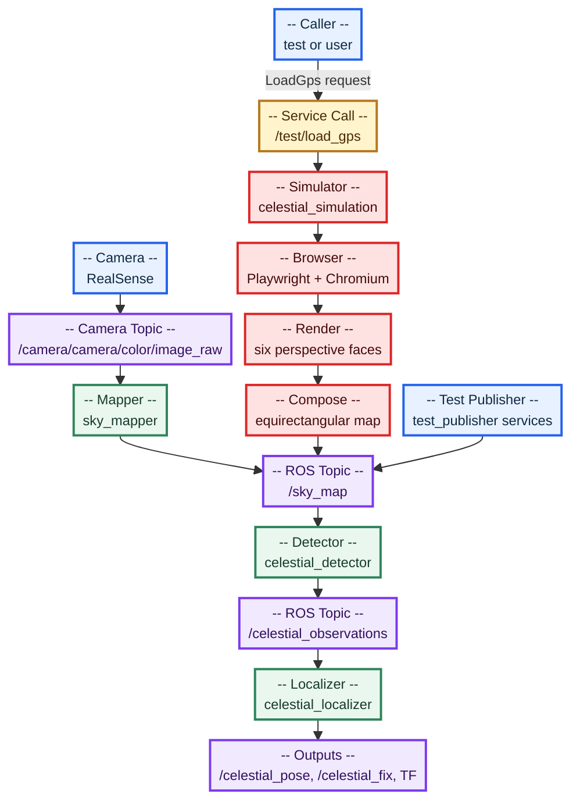
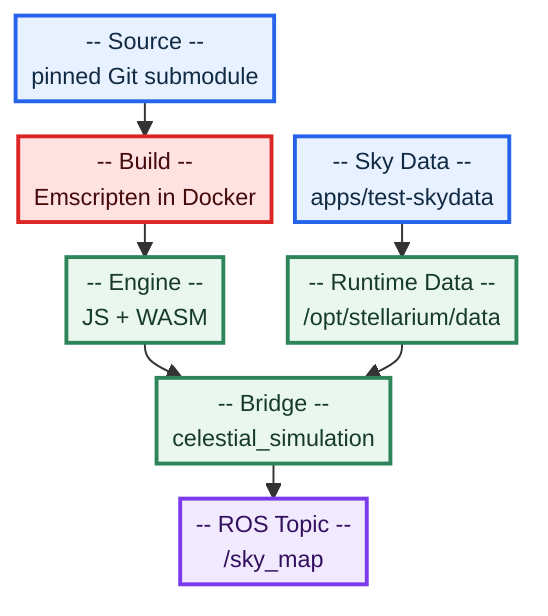

# Celestial Simulation Overview

## Goal

`celestial_simulation` provides a repeatable sky-map source for the existing
ROS 2 localisation pipeline. A caller supplies an observer latitude,
longitude, altitude, and UTC timestamp. The simulator asks Stellarium Web
Engine to render that view of the sky, converts the result to the same
equirectangular format used by the camera pipeline, and publishes one image
on `/sky_map`.

The simulator is an additional input source. It does not replace the
RealSense camera or the `sky_mapper` node.

## Pipeline Hook





  Color key: blue is a trigger, yellow is a service call, red is a sub-system
  process, green is node processing, and purple is topic activity.

All of these nodes can be launched together. The simulator is lazy: it opens
the browser only when `/test/load_gps` is called. The camera mapper and test
publisher can therefore remain available without causing simulator output.

Because the three sources publish to the same `/sky_map` topic, they should be
treated as alternative producers during a test. Avoid publishing from more
than one source at the same time if the detector results must correspond to a
single known input.

## Simulation Request

The service is defined in
[`LoadGps.srv`](../celestial_localisation/src/celestial_interfaces/srv/LoadGps.srv):

```text
float64 latitude
float64 longitude
float64 altitude
float64 yaw
builtin_interfaces/Time timestamp
---
bool success
string message
```

The request flow is:

1. Validate the coordinates, altitude, and timestamp.
2. Convert the ROS timestamp to UTC milliseconds.
3. Configure the Stellarium observer location, time, and camera yaw.
4. Render four horizon faces plus the zenith and nadir faces.
5. Composite the six faces into the configured equirectangular dimensions.
6. Publish one `bgr8` `sensor_msgs/Image` on `/sky_map`.

The request timestamp is also copied into the published image header. The
detector and localiser then process the simulated image exactly as they would
process a camera-generated sky map.

Example request:

```bash
ros2 service call /test/load_gps celestial_interfaces/srv/LoadGps "{latitude: 51.5, longitude: -0.1, altitude: 30.0, yaw: 0.0, timestamp: {sec: $(date -u +%s), nanosec: 0}}"
```

## Stellarium Assets

The Python browser bridge is not the Stellarium engine. Chromium is only the
runtime that displays the engine. The engine must be built and supplied with
its sky data.

```mermaid
%%{init: {"flowchart": {"nodeSpacing": 12, "rankSpacing": 18, "padding": 4}, "themeVariables": {"fontSize": "12px"}}}%%
flowchart TB
  AssetTrigger["Trigger"]
  AssetService["Service Call"]
  AssetSubsystem["Sub-System Process"]
  AssetNode["Node Processing"]
  AssetTopic["Topic Activity"]

  classDef trigger fill:#e8f1ff,stroke:#2563eb,color:#102a43,stroke-width:2px
  classDef service fill:#fff4cc,stroke:#b7791f,color:#4a2a00,stroke-width:2px
  classDef subsystem fill:#fee2e2,stroke:#dc2626,color:#450a0a,stroke-width:2px
  classDef node fill:#eaf7ef,stroke:#2f855a,color:#173b2a,stroke-width:2px
  classDef topic fill:#f1eafe,stroke:#7c3aed,color:#32105e,stroke-width:2px

  class AssetTrigger trigger
  class AssetService service
  class AssetSubsystem subsystem
  class AssetNode node
  class AssetTopic topic
```




The intended repository layout is:

```text
stellarium-web-engine/               # pinned Git submodule at repository root
```

During the Docker build, the upstream JavaScript/WebAssembly build output and
the required `apps/test-skydata` directories should be staged as:

```text
/opt/stellarium/
|-- stellarium-web-engine.js
|-- stellarium-web-engine.wasm
`-- data/
    |-- stars/
    |-- skycultures/western/
    |-- dso/
    `-- surveys/
        |-- milkyway/
        `-- sso/{sun,moon}/
```

The Compose asset bind mount must not mask this directory in the image. An
external asset directory can still be supported as an explicit override, but
the default container should contain the staged assets produced from the
pinned source revision. Stellarium Web Engine is licensed under AGPL-3.0 or a
commercial licence; distribution of the source and generated assets must
follow the licence selected for the project.

## Existing Components

- [`celestial_localisation.launch.py`](../celestial_localisation/src/celestial_bringup/launch/celestial_localisation.launch.py)
  starts the live mapper, simulator, detector, localiser, and test publisher.
- [`celestial_simulation`](../celestial_localisation/src/celestial_simulation/)
  owns the service callback, browser renderer, and panorama compositor.
- [`sky_mapper`](../celestial_localisation/src/sky_mapper/)
  remains the live camera-to-panorama path.
- [`celestial_detector`](../celestial_localisation/src/celestial_detector/)
  consumes `/sky_map` and publishes celestial observations.
- [`celestial_localiser`](../celestial_localisation/src/celestial_localiser/)
  consumes observations and publishes the estimated pose, fix, and TF.